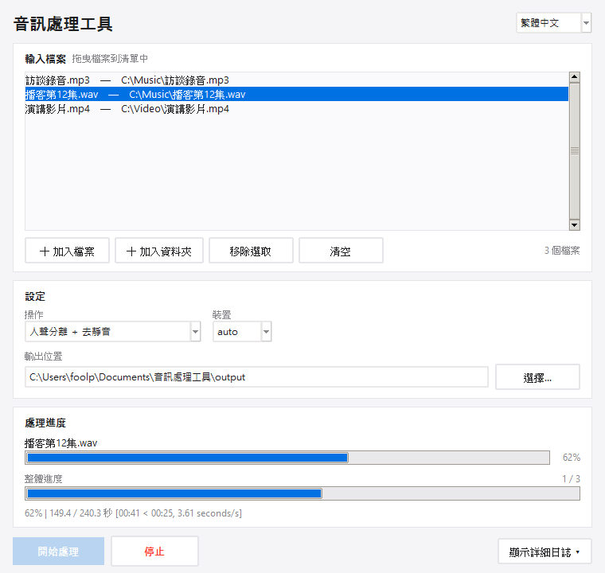

# 音訊處理工具 audio_tool

> 人聲分離・背景音樂/雜音去除・去靜音・音檔合併・影片轉音檔，支援 **AMD GPU (ROCm) 加速**，附**拖放式 GUI**。

<p align="center">
  
</p>

## 功能

- 🎤 **人聲分離** — 把人聲乾淨地抽出來，去除背景雜音與音樂（用 [Demucs](https://github.com/facebookresearch/demucs)）
- 🔇 **去除靜音** — 移除音檔中無聲 / 空白的片段
- 🔗 **合併輸出** — 把多個音檔合併成一個，輸出成 MP3
- ✂️ **自選剪輯** — 在波形上拖曳選取要剪掉的片段，可試聽後再輸出
- 📊 **音量標準化** — EBU R128 響度標準化（-14/-16/-23 LUFS）或峰值標準化
- 🔄 **音訊轉檔** — mp3 / wav / flac / m4a / ogg / opus 互轉
- ➗ **分割音檔** — 依每段長度或等分切成多段（同格式時無損秒切）
- 🎬 **影片轉音檔** — 從 mp4/mkv/mov… 抽出聲音
- 📁 **批次處理** — 一次處理整個資料夾
- 🖱️ **拖放 GUI** — 蘋果簡約風介面、獨立雙進度條、可中途停止；可打包成單一 exe
- ⚡ **GPU 加速** — 支援 AMD 顯卡 (ROCm 版 PyTorch)，CPU 也能跑

---

## 安裝

需要 **ffmpeg**（你電腦已有 ffmpeg 8.1.1）。依需求二選一：

### A. 一般版（CPU，最簡單）

Python 3.9+ 即可：

```powershell
py -m pip install -r requirements.txt
```

> 只想用「去靜音」和「合併」功能的話，只要裝 pydub：
> `py -m pip install pydub`

### B. AMD GPU 加速版（推薦給 RX 9070 XT）⚡

你的 **AMD Radeon RX 9070 XT (gfx1201/RDNA4)** 在 2026 年已被 AMD 官方支援，
可用 ROCm 版 PyTorch 走 GPU，人聲分離快非常多。

直接跑自動化安裝腳本（會裝 Python 3.12 + ROCm PyTorch + Demucs）：

```powershell
powershell -ExecutionPolicy Bypass -File .\setup_amd_gpu.ps1
```

**前置需求**：
- AMD「PyTorch on Windows」對應驅動（ROCm 7.2.1 需 Adrenalin **26.2.2** 以上）。
  到 <https://www.amd.com/en/support> 更新驅動。
- 安裝會用到 **Python 3.12**（ROCm 官方輪檔限定 cp312）；腳本會自動裝。

裝完用虛擬環境裡的 python 執行，並確認 GPU：

```powershell
.\.venv312\Scripts\python.exe audio_tool.py gpu
# GPU 可用 : True
#   [0] AMD Radeon RX 9070 XT
```

> 備援方案：若 ROCm 路線不順，可改用 DirectML（`pip install torch-directml`），
> 任何 DX12 顯卡都能跑，但較慢且已進入維護模式。

---

## 使用方式

### 1. 人聲分離（去背景雜音與音樂）

```powershell
py audio_tool.py vocals input.mp3 -o separated/
```

- 輸出 `separated/htdemucs/input/vocals.mp3`（乾淨人聲）
  與 `no_vocals.mp3`（伴奏 / 背景）。
- 第一次執行會自動下載模型。
- 加 `--wav` 可輸出無損 wav；`-m mdx_extra` 可換模型。
- **GPU**：預設 `-d auto` 會自動偵測；裝好 ROCm 版後可明確指定 `-d cuda` 用 AMD GPU，
  或 `-d cpu` 強制用 CPU。先用 `audio_tool.py gpu` 確認 GPU 有被抓到。

### 2. 去除無聲 / 空白片段

```powershell
py audio_tool.py trim input.wav -o clean.mp3
```

可調參數：
- `--silence-thresh -40`　靜音門檻 dBFS（越小越嚴格，雜訊多時可設 -50）
- `--min-silence-len 500`　連續靜音超過幾毫秒才移除
- `--keep-padding 100`　每段前後保留毫秒數，避免切太死

### 3. 合併多個音檔 → MP3

```powershell
py audio_tool.py merge a.mp3 b.mp3 c.wav -o final.mp3
```

- 依參數順序串接。
- `--crossfade 1000` 可讓相鄰段落交叉淡入淡出 1 秒。
- `--bitrate 320k` 設定音質。

### 4. 一鍵整合（分離人聲 → 去靜音）

```powershell
py audio_tool.py pipeline input.mp3 -o vocals_clean.mp3
```

### 5. 影片轉音檔

```powershell
py audio_tool.py extract movie.mp4 -o audio.mp3
```

支援 mp4 / mkv / mov / avi / webm…，輸出 `.mp3` 或 `.wav`。

### 6. 音訊轉檔

```powershell
py audio_tool.py convert input.wav -o output.mp3
py audio_tool.py convert song.flac -o song.m4a --bitrate 256k
```

- 輸出格式由副檔名決定：mp3 / wav / flac / m4a / aac / ogg / opus。
- 輸入放影片檔也可以（等同 extract）。

### 7. 自選剪輯（把指定片段剪掉）

```powershell
# 剪掉 0:30~1:00 和 2:10~2:45.5 兩段，其餘接起來
py audio_tool.py cut input.mp3 -o cut.mp3 --remove 0:30-1:00 --remove 2:10-2:45.5
```

- 時間可用 `秒`、`分:秒`、`時:分:秒`，重疊的片段會自動合併。
- **GUI 有波形編輯器**：選「剪輯（自選片段移除）」按開始處理，會開啟波形視窗 —
  拖曳選取片段 → ▶ 試聽確認 → 加入移除清單 → 輸出。

### 8. 分割音檔

```powershell
# 每 5 分鐘切一段
py audio_tool.py split input.mp3 -o parts/ --seconds 300

# 等分成 4 段
py audio_tool.py split input.mp3 -o parts/ --parts 4

# 分割同時轉檔
py audio_tool.py split input.wav -o parts/ --seconds 60 --fmt mp3
```

- 輸出 `parts/input_000.mp3`、`input_001.mp3`…
- 輸出格式與原檔相同時走**無損串流複製**，不重新編碼、幾乎瞬間完成。

### 9. 音量標準化

```powershell
# 響度標準化到 -16 LUFS（預設；兩段式 EBU R128，精準）
py audio_tool.py normalize input.mp3 -o norm.mp3

# 上傳串流平台用 -14，廣播用 -23
py audio_tool.py normalize input.mp3 -o norm.mp3 --lufs -14

# 峰值標準化：把最大音量拉到 -1 dBFS（快速、不改變動態）
py audio_tool.py normalize input.mp3 -o norm.mp3 --mode peak
```

- LUFS 模式會先量測一次再套用（兩段式 loudnorm），輸出響度非常精準。
- 多個檔案一起標準化後音量聽感會一致，適合合併前先處理。

### 10. 批次處理整個資料夾

```powershell
# 把資料夾內所有影片轉成 mp3
py audio_tool.py batch 影片夾 -o 輸出夾 --op extract

# 把資料夾內所有歌曲做「分離人聲+去靜音」（GPU）
py audio_tool.py batch 歌曲夾 -o 輸出夾 --op pipeline -d cuda

# 加 -r 連子資料夾一起處理
```

`--op` 可選 `extract / vocals / trim / pipeline`。單一檔失敗會跳過、不中斷整批。

---

## 圖形介面（拖放）🖱️

不想打指令的話，直接開 GUI：

- **雙擊** `啟動GUI.bat`，或
- 執行 `.\.venv312\Scripts\python.exe gui.py`

用法：把檔案 / 影片**拖進視窗**（或按「加入檔案 / 加入資料夾」）→ 選操作與裝置 →
設定輸出位置 → 按「開始處理」。

- **雙進度條**：上方是目前檔案的即時進度（含 Demucs %），下方是整體進度（第幾個 / 共幾個）。
- **停止按鈕**：可隨時中斷，會連同 Demucs / ffmpeg 子程序一起結束。
- 「音訊轉檔」「分割音檔」選了之後會出現對應的格式 / 位元率 / 每段長度選項。
- 詳細日誌預設收合，需要時按「顯示詳細日誌」展開。

> GUI 拖放需要 `tkinterdnd2`（已隨 setup 裝好）；即使沒有，也能用按鈕加入檔案。

### 打包好的 exe（最方便）

直接**雙擊 `音訊處理工具.exe`** 即可開啟 GUI，不必碰命令列。

- 這是輕量啟動器（約 7MB），會自動叫用 `.venv312` 環境，**GPU 加速正常**。
- ⚠ exe 必須留在專案資料夾裡（要和 `.venv312`、`gui.py` 同一層），不能單獨搬到別台電腦。
- 可對著它「建立捷徑」放到桌面 / 釘到工作列。
- 想重新打包：`.venv312\Scripts\python.exe -m PyInstaller --onefile --windowed --name 音訊處理工具 launcher.py`

---

## 常見組合範例

把一首歌抽出乾淨人聲、去掉空白，再和另一段旁白合併：

```powershell
py audio_tool.py vocals song.mp3 -o out/
py audio_tool.py trim out/htdemucs/song/vocals.mp3 -o vocal_clean.mp3
py audio_tool.py merge intro.mp3 vocal_clean.mp3 -o final.mp3
```

## 已驗證
- `trim` 與 `merge` 已用實際音檔測試通過。
- `vocals` 使用 Demucs 官方標準呼叫方式（需先安裝 torch）。
